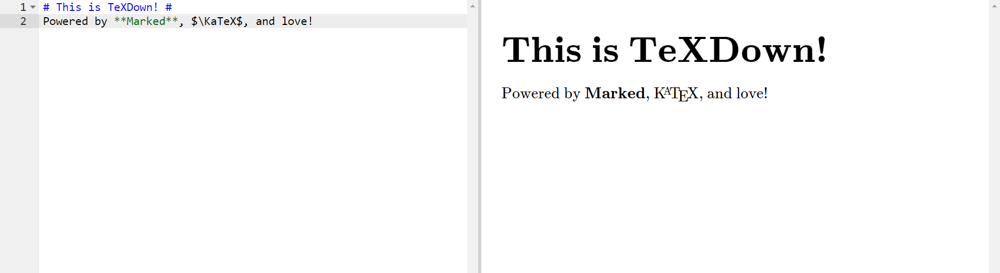

You can use both inline and block TeX:

```markdown
Did you know that $1 + 1 = 2$? I can prove it:

$$
\begin{aligned}
1 = 1 &\implies 2 = 2\\
&\implies \frac{2}{2}(2) = 2\\
&\implies \frac{1}{2}(2) + \frac{1}{2}(2) = 2\\
&\implies 1 + 1 = 2 
\end{aligned}
$$
```

You can also hit `Ctrl` + `M` to toggle print-friendly mode.
